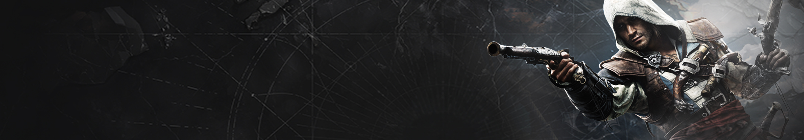

# Animus Mod & Outfit Manager

**Version 0.1.7 Beta — Assassin's Creed IV: Black Flag Resynced**

Animus Mod & Outfit Manager is a lightweight, MO2-inspired manager built
specifically for Black Flag Resynced. It brings ordinary mods, custom outfits,
weapon skins, crew textures, and Jackdaw sail designs into one focused desktop
application with reversible deployment and clear conflict information.

> This is a public beta for a young and rapidly changing modding scene. Keep
> the game closed while installing, enabling, disabling, or removing content.

## Download

Download the current portable package from the
[0.1.7 Beta release](https://github.com/jesseleehoffman82-ctrl/Animus-Mod-Manager---Assassin-s-Creed-Black-Flag-Resynced/releases/tag/v0.1.7-beta).

1. Install the Microsoft **.NET 10 Desktop Runtime x64**.
2. Download the `win-x64.zip` release asset.
3. Extract the complete ZIP to a normal folder. Do not run it from inside the
   archive.
4. Run `AnimusModManager.exe`.
5. Select or detect the Black Flag Resynced game folder.

Animus keeps its managed library, deployment state, and recovery information
inside its own application folder. Installing a newer numbered release over an
existing installation preserves that data.

## What each tab manages

### Mods

Installs conventional Nexus archives and native Animus `.jmod` packages. The
manager detects known game-relative folders, handles common loose-file mods,
backs up overwritten files, and restores them when a mod is disabled or
uninstalled.

Animus can safely share identical Ultimate ASI Loader proxies and supports a
documented secondary DLL name when a mod provides a compatible chaining rule.
It does **not** merge unrelated `version.dll` binaries or make executable hooks
from an older game update compatible with a newer build.

### Outfits

Installs and manages custom Edward outfit replacements without requiring a
separate outfit installation utility. Known texture targets are read from the
pack, displayed as the vanilla outfit being replaced, and patched directly into
the appropriate game archive resources.

Several outfits may remain installed. When two outfits share the same vanilla
slot, Animus identifies every occupant—including disabled ones—and asks before
disabling an enabled conflict.

### Weapons

Manages weapon texture replacements with the same enable, update, rename,
restore, and uninstall workflow. Texture files are validated against the target
material and slot before deployment.

### Crew

Manages Jackdaw crew textures using 40 measured vanilla targets. During
installation you can:

- choose **automatic filename detection** for a complete, correctly named
  multi-texture crew pack; or
- assign a single generic DDS/PNG texture to a specific vanilla crew target.

The Crew table shows exactly which vanilla crew texture is replaced. Packs
sharing a target are identified even while disabled, and enabling a conflict
opens the same confirmation workflow used for outfits and sails.

### Sails

Installs custom Jackdaw sail designs without depending on a separate sail
installation utility. Animus asks which vanilla sail cosmetic the design should
replace and offers 45 targets validated against the current Title Update 1.0.7
archive.

Multiple sail designs can be installed and enabled together when they target
different vanilla sail sets. If a new design uses an occupied target, Animus
warns you and can disable the enabled design already using that target. Updating
a sail retains its chosen target.

The separate cosmetic-slot injection system developed for Jackdaw Drydock
Studio is not included here. Animus uses reversible vanilla sail replacements.

## Common workflow

1. Open the appropriate tab.
2. Select **Install** and choose a downloaded ZIP, 7z, RAR, DDS, PNG, or other
   supported archive/file.
3. Confirm the vanilla target when the Crew or Sails picker appears.
4. Use the green checkbox to enable or disable an item.
5. Open the `•••` menu to update, rename, view details, open its Nexus page, or
   uninstall it.
6. Launch the game through Steam with **Launch Game**.

Disabling a managed item restores the affected data and leaves the item in the
manager. Uninstalling restores its files and removes it from the library.

## Deployment and recovery

- Texture replacements patch validated resources in `DataPC_boot.forge`.
- External mip writes and repointed material data are journaled.
- Original bytes are backed up before a write is made.
- Enabled texture packs are rebuilt from a known vanilla baseline.
- Game-update detection avoids restoring stale material pointers over a newly
  updated Ubisoft archive.
- Animus patches files on disk; it does not inject its own code into the running
  game process.

## Nexus integration and privacy

Nexus integration is deliberately metadata-only. Animus uses Nexus Mods'
public, unauthenticated GraphQL endpoint to read linked mod names, authors,
versions, summaries, and page information.

- No personal Nexus API key is included, requested, or stored.
- No Nexus password, OAuth login, or account credential is used.
- No direct Nexus file downloading is implemented.
- Downloads remain in the user's browser and are selected locally afterward.

The application continues to work offline for local installation and management
operations; only optional Nexus metadata requires a network connection.

## Supported environment and limitations

- Windows 10/11 x64
- Assassin's Creed IV: Black Flag Resynced
- Microsoft .NET 10 Desktop Runtime x64
- Microsoft Edge WebView2 Runtime
- PNG conversion supports compatible BC1/BC3 targets; BC7 targets require a
  game-ready DDS.
- Script hooks and ASI mods may require updates whenever Ubisoft changes the
  executable. File management cannot repair an outdated binary hook.
- Spanish sails currently remain excluded from selectable targets because they
  live in a separate FORGE archive that requires its own transaction journal.

## Building and reviewing the source

The authored C#, Python, HTML, CSS, and JavaScript source is available in this
repository. See [BUILDING.md](BUILDING.md) for dependency setup, build commands,
and regression-test instructions. Third-party runtimes and compiled utilities
are intentionally excluded from the source-only review archive.

Development was human-directed and AI-assisted. Additional details are recorded
in [DEVELOPMENT-NOTES.txt](DEVELOPMENT-NOTES.txt).

## Feedback

Please report successful installations as well as failures, game-build
compatibility problems, incorrect texture targets, and archives Animus cannot
recognize. Include the mod name, archive structure, selected tab/target, and the
Activity message when possible.
