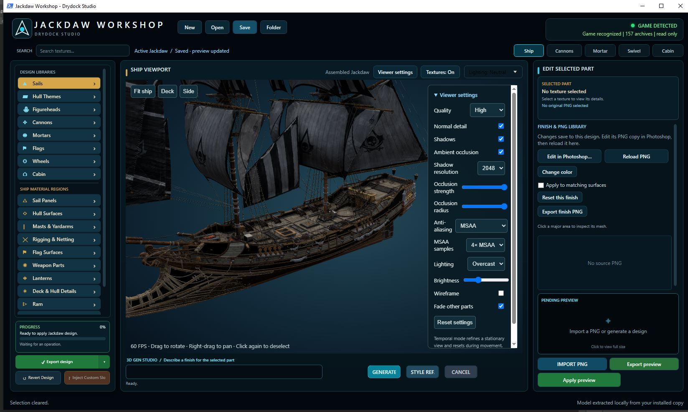

# Jackdaw Drydock Studio

**Early development prototype · Status: 24 September 2026**

[Browse the GPL-3.0 prototype source](../../drydock-studio/) · [Build status and source checks](../../drydock-studio/BUILDING.md)

Jackdaw Drydock Studio is a companion project to [Animus Mod & Outfit Manager](../../README.md), developed by Jesse Hoffman for the Assassin's Creed Black Flag Resynced modding community.

The aim is to make ship customization approachable through a 3D workspace where people can inspect the Jackdaw, select surfaces, edit textures, and see their changes on the model.

## Development screenshot

The screenshot shows the actual Jackdaw model extracted locally from the game by Astra and reassembled in Blender to match the in-game ship. Drydock Studio loads that reconstructed model for customization; the edited hull and sail textures shown here are applied to it in the app. This is a working development preview, not a mock-up. Material and texture accuracy is still being refined, and the complete workflow for installing those customizations back into the game remains unfinished.

## Current prototype

Development builds have demonstrated:

- An interactive assembled Jackdaw preview with ship, deck, and side views.
- PNG texture import and reloading textures edited in an external image editor.
- Surface selection, color changes, and experimental painting controls.
- Adjustable preview lighting, including warm lantern lights.
- Saving design work for continued editing.

These are prototype capabilities, not a finished or independently validated public release. Material assignments, UV mapping, selection boundaries, and cabin/window appearance still need work.

## What is not working as a complete workflow yet

The application does **not** currently offer a verified end-to-end workflow for rebuilding the Jackdaw from a fresh game installation, applying a custom design, and installing it into the game.

Native resource inspection and packaging experiments are underway. A reliable additional cosmetic slot, texture routing, compatibility checks, and restoration still need development and in-game validation. There is no public Drydock installer or ready-to-use download on this page.

## Development priorities

1. Correct the model's materials and texture mapping, including cabin trim and windows.
2. Make selections, painting, undo, and saved designs dependable.
3. Build and validate local extraction and model assembly without developer caches.
4. Complete and test installation and restoration against supported game versions.
5. Prepare a clean public release with clear instructions and limitations.

Additional customization ideas include decals, hull and figurehead variants, and optional environment previews. These are future possibilities, not release commitments.

## Relationship to Animus

Animus Mod & Outfit Manager is the separately published manager in this repository. Drydock is an early companion project and must not be confused with the manager's released capabilities.

For project applications and reviews, this page documents Drydock's scope and development status. The authored prototype source is now published under GPL-3.0-only in the drydock-studio directory. It is an unfinished source snapshot with missing runtime dependencies and generated assets, not a ready-to-run public application.

## Assets and distribution

Game archives, extracted textures and meshes, assembled ship models, local caches, and third-party toolkit binaries are not distributed here. The intended public application will reconstruct the preview locally from a supported installation owned by the user; that clean-install workflow remains unfinished.

This is an independent fan project and is not affiliated with or endorsed by Ubisoft.

## Development approach

Development is human-directed and AI-assisted. The focus is on a useful, maintainable tool for the modding community, with unfinished work and experimental features identified openly.
